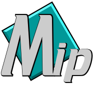

# Markdown Instant Preview - Rust edition



Markdown Instant Preview aka `mip` is a fast and bloatless markdown document
viewer. Mip uses a webview window to render the markdown. I wrote `mip` to
preview my markdown files which I write in vim.

After a first attempt of developing [Mip in
Crystal](https://github.com/mipmip/mip.cr), Rust seemed a better choice as it
has more mature parallism support. This is essential for running webview next
to a webserver.

See the simple workflow in this video...

[mip-video.webm](https://user-images.githubusercontent.com/658612/209807766-3df2fc42-e53a-4183-aff4-9ed0acc6e449.webm)

## Features

- built-in webserver
- preview images
- hides frontmatter
- autoreload if file changes

## Installation

- no releases yet. You should compile it yourself. See instructions below..

## Usage

```
mip [markdown file]
```

## Todo

- [ ] prj: Readme best practices
- [ ] app: command line options
- [ ] app: improve error handling
- [ ] app: use webview reload and not javascript reload
- [ ] prj: refactor cleanup var names
- [ ] prj: testing
- [ ] prj: release workflow
  - [ ] auto build binaries at release
  - [ ] version tag script
  - [ ] set version and date in changelog
- [ ] app: table of contents
- [ ] app: reload keybinding
- [ ] app: rm temp files
- [ ] app: vim keybindings
- [ ] app: export pdf
- [ ] app: export html
- [ ] blog: mip.cr and mip.rs
- [ ] prog: nix build
- [ ] app: linux desktop info

## Development

### Prerequisites

- webkitgtk
- rust
- yarn (if you want modify the html template)

### Setup HTML Template dev Environment

```bash
yarn
```

### Compile and run program

```bash
cargo run
```

### Build optimized program

```bash
cargo build --release
```

### Compile themes

```bash
make compthemes
./mip
```

## Contributing

1. Fork it (<https://github.com/mipmip/mip.rs/fork>)
2. Create your feature branch (`git checkout -b my-new-feature`)
3. Commit your changes (`git commit -am 'Add some feature'`)
4. Push to the branch (`git push origin my-new-feature`)
5. Create a new Pull Request

## Contributors

- [Pim Snel](https://github.com/mipmip) - creator and maintainer
